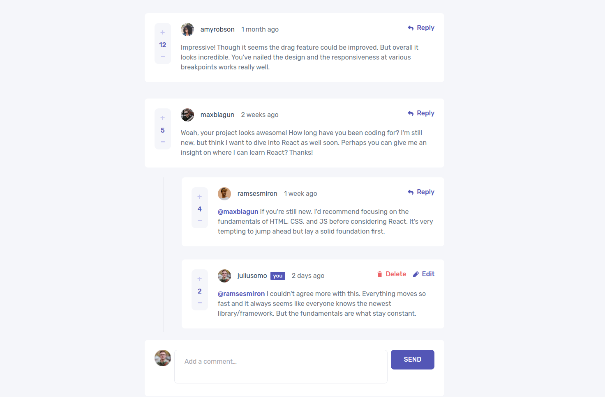

# Frontend Mentor - Interactive comments section

solution

This is a solution to the [Interactive comments section
challenge on Frontend Mentor](https://www.frontendmentor.io/challenges/interactive-comments-section-iG1RugEG9). Frontend Mentor challenges help you improve your coding skills by building realistic projects.

## Table of contents

-   [Overview](#overview)
    -   [The challenge](#the-challenge)
    -   [Screenshots](#screenshots)
    -   [Links](#links)
-   [My process](#my-process)
    -   [Built with](#built-with)
-   [Author](#author)

## Overview

### The challenge

Users should be able to:

-   View the optimal layout for the app depending on their device's screen size
-   See hover states for all interactive elements on the page
-   Create, Read, Update, and Delete comments and replies
-   Upvote and downvote comments
-   **Bonus**: If you're building a purely front-end project, use localStorage to save the current -state in the browser that persists when the browser is refreshed
-   **Bonus**: Build this project as a full-stack application

### Screenshots

### Links

-   Live Site URL: [PROD](https://interactive-comments-section-isptufromua.vercel.app/)

## My process

### Built with

-   [Svelte](https://svelte.dev)
-   [SvelteKit](https://kit.svelte.dev)
-   [TypeScript](https://www.typescriptlang.org/)
-   [Windi CSS](https://windicss.org/)
-   [Prettier](https://prettier.io/)
-   [ESLint](https://eslint.org/)

## Author

-   Ivan Sprut
-   Frontend Mentor - [@ivansprut](https://www.frontendmentor.io/profile/isprutfromua)
